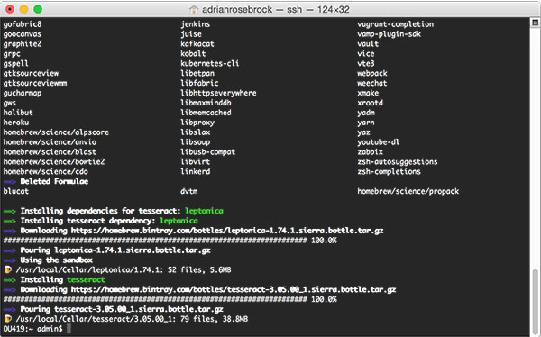
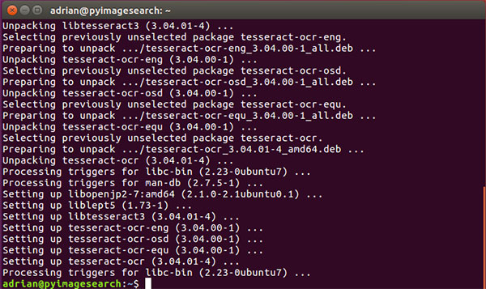
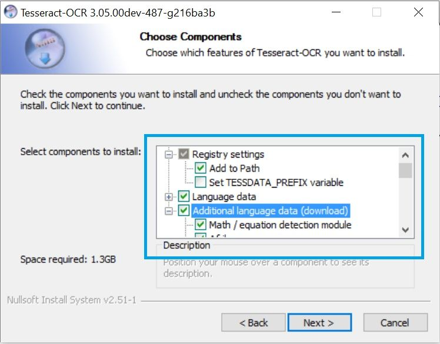
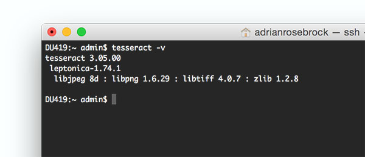
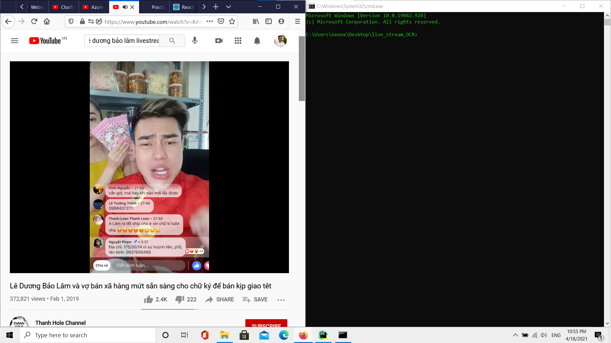

# Text recognition on Facebook live stream comments using Tesseract OCR

## About
In this project, I install Tesseract OCR model to recognize text on comments live stream Facebook for Vietnamese. The Tesseract OCR model has many advantages over the architecture of the CRNN and Transformer OCR models developed earlier.

The Tesseract OCR model has very good generality, even with a fairly high accuracy on a new dataset, although the model has never been trained.
## Brief history

Tesseract was originally developed at Hewlett-Packard Laboratories Bristol and
at Hewlett-Packard Co, Greeley Colorado between 1985 and 1994, with some
more changes made in 1996 to port to Windows, and some C++izing in 1998.
In 2005 Tesseract was open sourced by HP. Since 2006 it is developed by Google.

The latest (LSTM based) stable version is **[4.1.1](https://github.com/tesseract-ocr/tesseract/releases/tag/4.1.1)**, released on December 26, 2019.
Latest source code is available from [master branch on GitHub](https://github.com/tesseract-ocr/tesseract/tree/master).
Open issues can be found in [issue tracker](https://github.com/tesseract-ocr/tesseract/issues),
and [planning documentation](https://tesseract-ocr.github.io/tessdoc/Planning.html).

The latest 3.0x version is **[3.05.02](https://github.com/tesseract-ocr/tesseract/releases/tag/3.05.02)**, released on June 19, 2018. Latest source code for 3.05 is available from [3.05 branch on GitHub](https://github.com/tesseract-ocr/tesseract/tree/3.05).
There is no development for this version, but it can be used for special cases (e.g. see [Regression of features from 3.0x](https://tesseract-ocr.github.io/tessdoc/Planning.html#regression-of-features-from-30x)).

See **[Release Notes](https://tesseract-ocr.github.io/tessdoc/ReleaseNotes.html)**
and **[Change Log](https://github.com/tesseract-ocr/tesseract/blob/master/ChangeLog)** for more details of the releases.

## Instruction
I would like to present the structure of the instruction in advance for you to have an overview. The instruction will include three sections:

Part 1. Prepare environment, install Tesseract OCR library.

Part 2. Configuring and adding Vietnamese language.

Part 3. Write code to recognize and enjoy.

### Part 1. Prepare environment
Please create a folder to save somewhere on your hard drive (here I named the folder **live stream OCR**). Now, install Tesseract OCR in the following way, depending on what OS you use.

For **MacOS** users: We will install with the Homebrew tool offline. Type the following command:

`brew install tesseract`

After typing, wait for the command to finish running!

Source: pyimagesearch

For **Linux** users: Use apt-get as follows:

`sudo apt-get install tesseract-ocr`

Then also wait for it to run all of the command.

Source: pyimagesearch

For **Window** users: Download the installation file here https://github.com/UB-Mannheim/tesseract/wiki (remember to choose the 32bit and 64 bit version that suits your window).

After the installation is complete, you can check whether the installation was successful by typing the command:

`tesseract -v`

If the screen shows version information as shown below, you have successfully installed.

If the error is "command not found" or "is not recognized", then you should restart your device or set the PATH accordingly (this depends on the OS).

### Part 2. Configuring and adding Vietnamese language
So you have installed Tess OCR library. However, it does not have Vietnamese language by default and we have to install it.

Access the link https://github.com/tesseract-ocr/tessdata select Vietnamese language, which is the vie.traineddata file downloaded to your computer and copied to Tess OCR's language directory.

Surely you will ask where the language directory is? This depends on the directory you install in, which operating system. The language directory named **tessdata** is located in the **Tesserac OCR** installation directory. Generally speaking, there is a folder called **tessdata** on your computer, find it and copy the **vie.traineddata** file to that **tessdata** directory.

### Part 3. Write code to recognize and enjoy
Finished configuration, now write code in Python for recognition.

For the code to work, please install the following libraries:

`pip install pillow`

`pip install pytesseract`

`pip install opencv-python`

or install the requirements.txt file by the following command:

`pip install requirements.txt`

Now, download the source on my github to the folder you created before (https://github.com/minhkhoi1412/live_stream_OCR) or type the following command:

`git clone https://github.com/minhkhoi1412/live_stream_OCR`

In your directory will appear the **live_stream_OCR** folder. For the file **main.py** features, I have commented line by line in the code already. For now, move into that directory with the command cd **live_stream_OCR** and divide the computer screen into two halves, one half is the command line window, and the other half is the window containing the live video stream as shown below:

After that, follow the steps as shown below and enjoy the results:

## Latest Version of README

For the latest online version of the README.md see:

https://github.com/minhkhoi1412/live_stream_OCR/README.md